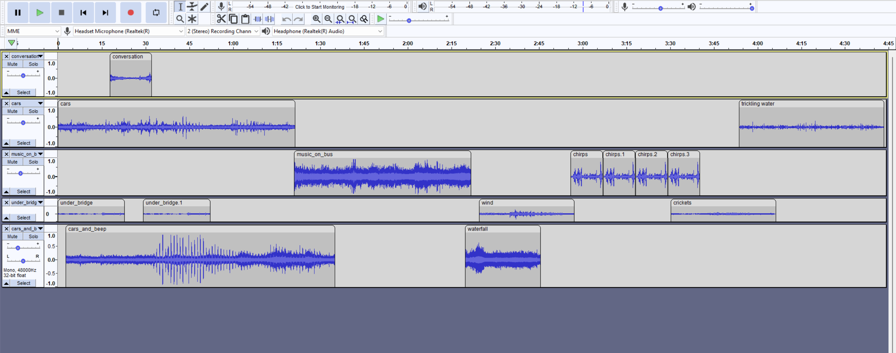

# soundscape-cdm
<h2>Soundscape Narrative for ENGCMP0610 (Composing Digital Media)</h2>
<h4>By: Zane Kissel</h4>

<h3>14 September 2022, First Draft:</h3>

To start off my project I've included urban sounds in the first half of my project, and sounds of nature in the second half.
All of the audio included in the project has been recorded by myself, on my cellphone.

I'm happy with the general theme of each half of my project, but I would really like to smooth out the transitions. I should be able to achieve this by utilizing the tools in audacity, but also by expanding the set of sounds I've included so far.

<i>As a final note, my project's .aup3 file is too large to be uploaded to GitHub, so I will include that on Canvas and look into a fix.</i>

