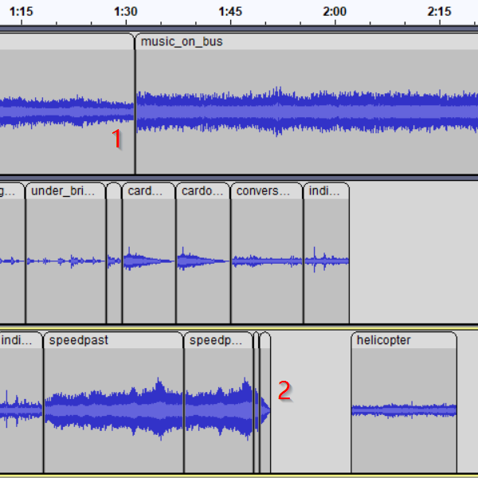

<h3>14 September 2022, First Draft:</h3>

To start off my project I've included urban sounds in the first half of my project, and sounds of nature in the second half.
All of the audio included in the project has been recorded by myself, on my cellphone.

I'm happy with the general theme of each half of my project, but I would really like to smooth out the transitions. I should be able to achieve this by utilizing the tools in audacity, but also by expanding the set of sounds I've included so far.

<i>As a final note, my project's .aup3 file is too large to be uploaded to GitHub, so I will include that on Canvas and look into a fix.</i>

<h3>19 September 2022, Full Draft:</h3>

I've evolved my project beyond the first draft by recompiling it entirely. I kept the same idea, but rearranged most of the audio pieces, this time with a little bit more intent for organization.

<ul><li>An important developmental step for my project is eliminating abrupt noise transitions, especially when considering the background track. I've solved this problem in a couple of different ways so far, including two here. Near number two I used "Fade out" to smooth the transition, but for number one I kept the abrupt transition and covered it with another chaotic, albeit more natural, sounding car engine. </li></ul>

<ul><li>Another question that I had to answer while constructing my project was how I wanted to transition from the city to nature. I chose to include the sound of cicadas right at the intersection, because many of my "nature" audio recordings included these already, and they're just as common in the city.</li></ul>

Lastly I have embedded a picture of my entire project as it is right now, which is a lot more full than my initial draft. For finishing touches I still wish to incorporate smoother transitions, and ensure that there is an interesting sound to focus on throughout the whole piece.

