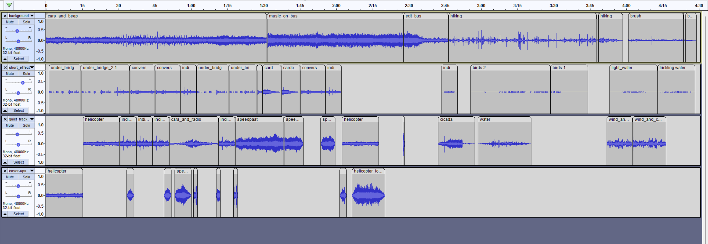
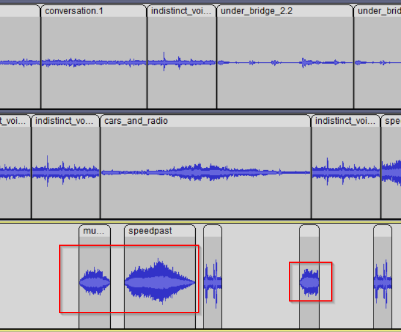
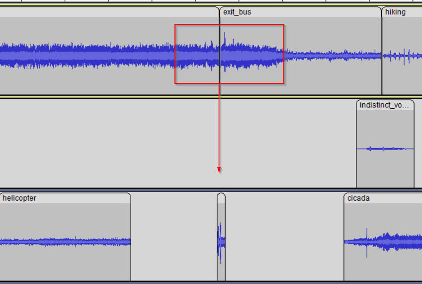

<h2>Project Reflection</h2>
<h3>Overview</h3>

With this piece, I wanted the listener to realize the stark contrast between different environments in our society. Like starting with bad news, I chose to present the urban environment first. This way, the comfort of the listener in the natural environment is emphasized. When examining the picture of my full audioscape, one can see that the first half is a lot busier. The sounds in the first part are louder and more common. The second half of my project looks much more cleaned up, in terms of audio. These sounds have lower decibal peaks and smoother transitions, better emulating a serene outdoor environment. These basic design choices contributed to the overall mood of the piece throughout.

<h3>Insights</h3>

Below is a closer look at another design choice I made. Throughtout my soundscape, I used audio from different parts of Oakland and Schenley. This allowed for many excellent recordings for both ends of my spectrum. However, the different recordings have different atmospheres or backgrounds. I wanted my project to span for longer than two minutes, so I needed to append more recordings. The problem arises when I have two similar volume recordings that I want to place side by side, but there is a noticeable difference in the atmospheric noise. My goal to depict the city as a busy place opened the option for me to solve this problem without audio-editing tools. As depicted in the red boxes below, I copied audio samples of various traffic noises and pasted them where the atmosphere abruptly and noticeably changes. A very important step for this method was fading in and out each interrupt noise, giving the effect that the noise is passing the listener by. This increases the noise-level and frequency that we hear city-like sounds, while smoothing out the audio in a way that sounds more native to the city.

In the picture below is a closer look at my method for transitioning the soundscape from one environment to the next. In this scenario, I had an audio recording of my trip on the bus and recordings from walking on a path away from the city. I want my story to be interpretive to some extent, so obfuscating the transition between the bus (city) and path (nature) was a goal of mine. I started with using noise reduction on my bus recording, to try to remove some static background noise. I proceeded with compressing the two recordings in track 1, so that their audio levels were similar, giving a smoother transition. Next, I implemented my method used previously, where I cover the transition of audio with another more distracting recording. The combination of these three techniques helped me to smooth the transition from one scene to the next.

